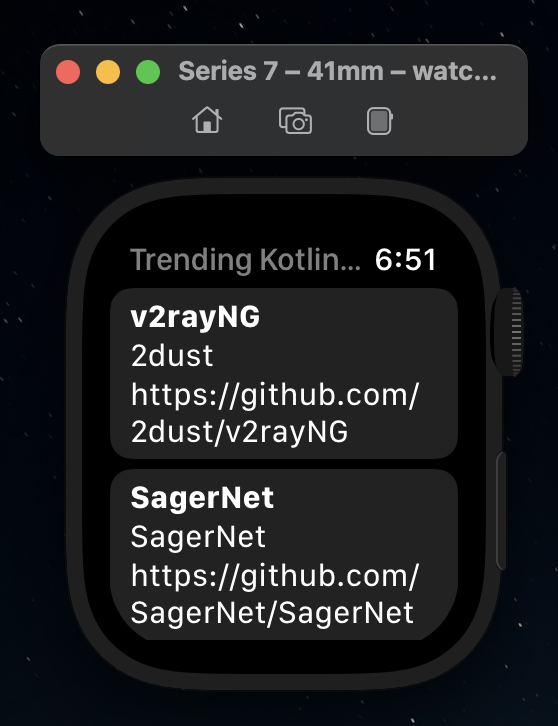
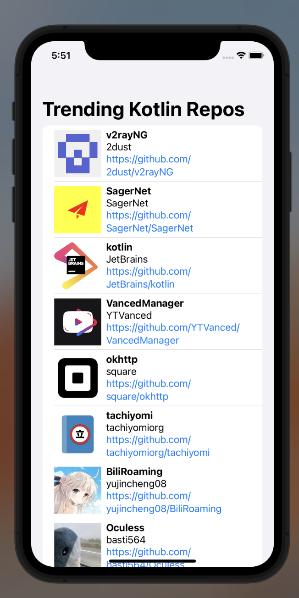

# PraxisKMM

Minimal **Kotlin Multiplatform** project with SwiftUI, Jetpack Compose, Compose for Wear OS,. Currently running on

* Android (Jetpack Compose) 🚧 In progress
* Android App Widget 🚧 In progress
* Wear OS (Compose for Wear OS) 🚧 In progress
* iOS (SwiftUI) ✅ DONE
* iOS App Widget (SwiftUI) 🚧 In progress
* watchOS (SwiftUI) ✅ DONE
* macOS (SwiftUI) ✅ DONE

### Screenshots

* watchOS (SwiftUI)

* iOS (SwiftUI)

* macOS (SwiftUI)

### Languages, libraries and tools used

* [Kotlin](https://kotlinlang.org/)
* [Kotlin Coroutines](https://kotlinlang.org/docs/reference/coroutines-overview.html)
* [Kotlinx Serialization](https://github.com/Kotlin/kotlinx.serialization)
* [Ktor client library](https://github.com/ktorio/ktor)
* [Android Architecture Components](https://developer.android.com/topic/libraries/architecture/index.html)
* [Koin](https://github.com/InsertKoinIO/koin)
* [SQLDelight](https://github.com/cashapp/sqldelight)
* [Jetpack Compose](https://developer.android.com/jetpack/compose)
* [SwiftUI](https://developer.apple.com/documentation/swiftui)
* [KMP-NativeCoroutines](https://github.com/rickclephas/KMP-NativeCoroutines)